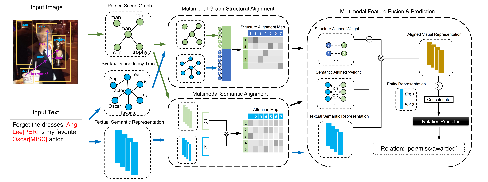

# Source Code of MEGA Model for Multimodal Relation Extraction
Implementation of Our Paper "Multimodal Relation Extraction with Efficient Graph Alignment" in ACM Multimedia 2021. This Implementation is based on the [OpenNRE](https://github.com/thunlp/OpenNRE).

## Model Architecture

The Overall Framework of Our Proposed MEGA Model. Our Model Introduces Visual Information into Predicting Textual Relations. Besides, We leverages the Graph Structural Alignment and Semantic Alignment to Help Model Find the Mapping From Visual Relations to Textual Contents.

## Requirements
